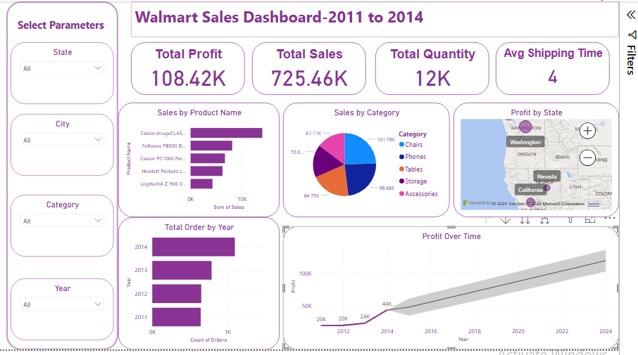

# 🏆 Rana Elamir Mourad - Business Analyst Portfolio

## 📌 About Me
I am a results-driven **Business Analyst & Power BI Engineer** with a strong foundation in **data analysis, process improvement, and project management**. My expertise lies in **translating data into strategic insights** that enhance business efficiency and decision-making.

📍 **Location**: El Sharqiyah, Egypt  
📧 **Email**: rana.elamir.mourad@gmail.com  
🔗 **Portfolio**: [Online Portfolio](https://xandergram.my.canva.site/portfolio-rana-elamir)  
🔗 **LinkedIn**: [Profile](http://linkedin.com/in/ranaelamir)  
🔗 **GitHub**: [Projects](https://github.com/Rana-mourad/Power-BI-Projects)

---

### **Sales Performance Dashboard**  
📌 **Overview:** Created a Power BI dashboard to track **sales trends and performance metrics**.  
🔧 **Tools Used:** Power BI, Excel.  
🛠 **Key Features:**  
- **Data Cleaning & Transformation**: Used Power Query to preprocess raw sales data from a single source.  
- **Visualization**: Designed interactive charts to display **monthly revenue, top-selling products, and customer segments**.  
- **KPIs & DAX Measures**: Implemented **sales growth rate, revenue trends, and performance comparisons** using DAX.  

### **Walmart Sales Dashboard**  
📌 **Overview:** Built a **Walmart sales analysis dashboard** to explore product performance.  
🔧 **Tools Used:** Power BI, Excel.  
🛠 **Key Features:**  
- **Dynamic Filters & Drilldowns**: Created slicers for **category, region, and time-based analysis**.  
- **Data Modeling**: Transformed raw Excel data to generate **profitability insights**.  
- **Custom Visuals**: Used bar charts, line graphs, and KPI cards for better data storytelling.  

### **Financial Analytics Dashboard**  
📌 **Overview:** Developed a **finance tracking dashboard** to visualize budget and expense breakdowns.  
🔧 **Tools Used:** Power BI, Excel.  
🛠 **Key Features:**  
- **Expense Analysis**: Categorized and visualized **monthly spending trends**.  
- **Profit & Loss Breakdown**: Used Power BI visuals to track **income vs. expenses**.  
- **Dashboard Navigation**: Included **interactive buttons for quick insights**.  

---

## 💼 Work Experience

### **Product Development Lead** | Anoush.AI, Egypt *(Jan 2024 - Present)*  
- Conducted **market research** using data analysis techniques, gathering insights from **50+ users** and analyzing **7 competitor platforms**.
- Applied **Python (Pandas, NumPy)** and **Excel** for competitor benchmarking and feature prioritization.
- Developed a **product roadmap** focusing on four core user personas, streamlining feature development.

### **Project Manager Intern** | Excelerate, Dubai, UAE *(Aug 2024 - Oct 2024)*  
- Delivered a **global event** within a **$10,000 budget**, ensuring **100% task completion**.
- Designed a **quality control framework** that boosted task efficiency by **20%**.
- Used **Kanban boards & Agile tools** to track **25+ milestones**, boosting coordination by **25%**.

### **Social Media Marketing Intern** | HookZApp, London, UK *(Nov 2022 - Jun 2023)*  
- Managed **social media campaigns**, increasing engagement by **30%**.
- Analyzed **social media metrics**, leading to a **25% increase** in engagement and follower growth.
- Collaborated with the marketing team, improving content effectiveness by **20%**.

### **Founder & Social Media Manager** | H&T Group, Cairo, Egypt *(Nov 2021 - Aug 2022)*  
- Grew **1,000+ followers** in **3 months** through data-driven content strategies.
- Increased **engagement rates by 25%** through interactive posts and analytics-driven improvements.

---

## 🎯 Skills & Tools

### **Technical Skills**
- **Data Analytics:** Power BI, Excel.
- **Project Management:** Agile, Scrum, Kanban, Quality Control Frameworks.
- **Business Analysis:** Market Research, Process Optimization, Strategic Planning.

### **Soft Skills**
- Problem-Solving | Critical Thinking | Communication | Collaboration | Innovation | Documentation

### **Languages**
- English (Fluent) | Arabic (Native)

---

## 🎓 Education & Certifications

🎓 **Master’s in Medicinal Chemistry** *(2024 – Present)* | Mansoura University  
🎓 **Bachelor’s in Pharmacy** *(2018 – 2023)* | Modern Sciences and Arts University  

📜 **Power BI Engineering** – DEPI *(In Progress)*  
📜 **Data Science Professional Certificate** – IBM *(2024)*  
📜 **Google Project Management** – Google *(In Progress)*  
📜 **PMP Preparation Course** – BIM Arabia *(2024)*  
📜 **Flutter Course** – UN Women *(2023)*  
📜 **Digital Marketing Nanodegree** – Udacity *(2020)*  

---

## 🏆 Awards & Recognitions

- **Founder Academy & Heya Raeda (2024)** – Pitched **Anoush.AI** as an innovative healthcare solution.  
- **Top 50 Trainees – Akhnaton Trading (2023)**  
- **Public Health Campaign Contributor – EPSF (2020)**  

---

## 📌 Contact & References
📧 **Email**: rana.elamir.mourad@gmail.com  
🔗 **LinkedIn**: [Profile](http://linkedin.com/in/ranaelamir)  
🔗 **GitHub**: [Projects](https://github.com/Rana-mourad/Power-BI-Projects)  
📜 **References**: Available upon request.  

---

💡 *This portfolio showcases my expertise in business analytics, data visualization, and project management. Feel free to explore my work and connect with me!* 🚀
